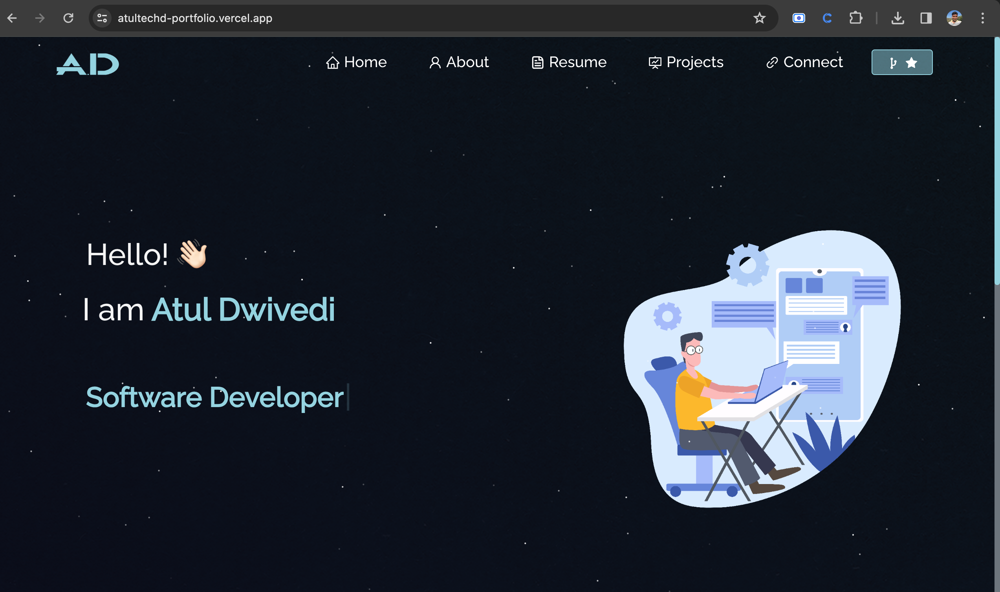

## [MyPortfolio Website](https://atultechd-portfolio.vercel.app/)

A personal website to showcase your skills, projects, and achievements, built with React.js, JavaScript, and CSS.

## Project Status

This project is complete and ready to be deployed. You can customize it with your content and deploy it to showcase your portfolio.

## Project Screen Shot(s)

## Installation and Setup Instructions

Clone this repository. You will need `node` and `npm` installed globally on your machine.

Installation:

`npm install`

To Run Test Suite:  

`npm test`  

To Start Server:

`npm start`  

To Visit App:

`localhost:3000`  

## Reflection

This project was developed to create a personal portfolio website for showcasing skills, projects, and achievements. It's designed to help individuals build an online presence. The goal was to build a responsive portfolio website using React.js to display personal information.